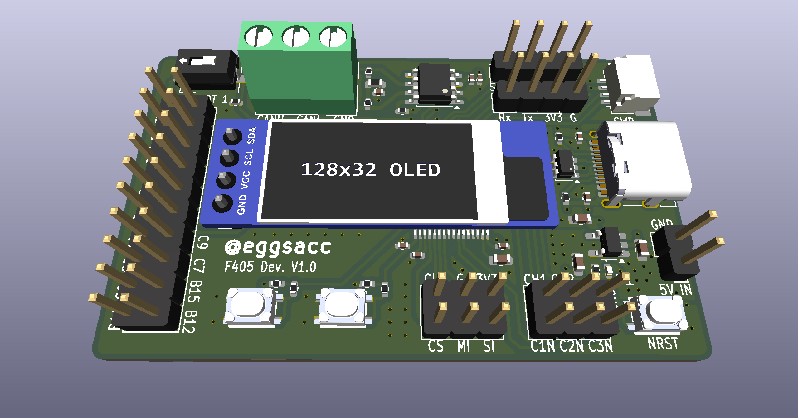
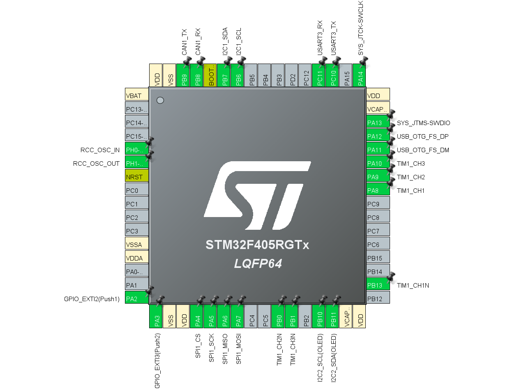
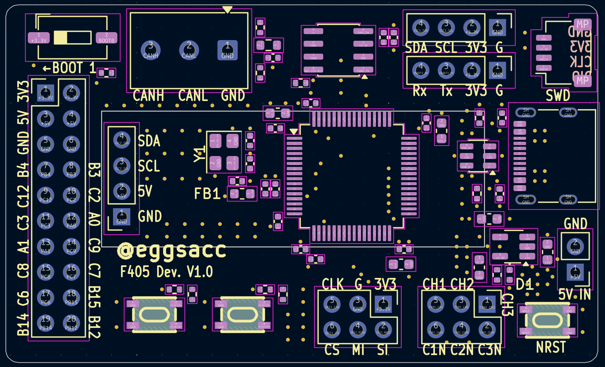

# STM32F405 Dev Module

---

## Pinout

---

| Breakout / feature | Peripheral | Pin mapping |
|---|---|---|
| **UART header** | `USART3` | TX &rarr; `PC10` RX &rarr; `PC11` |
| **SPI header** | `SPI1` | CS &rarr; `PA4` SCK &rarr; `PA5` MISO &rarr; `PA6` MOSI &rarr; `PA7` |
| **I2C header** | `I2C1` | SCL &rarr; `PB6` SDA &rarr; `PB7` |
| **CAN screw terminal** | `CAN1` (SN65HVD230) | TX &rarr; `PB9` RX &rarr; `PB8` |
| **USB-C** | `USB_OTG_FS` | D&minus; &rarr; `PA11` D+ &rarr; `PA12` |
| **SWD header** | `SYS` | SWDIO &rarr; `PA13` SWCLK &rarr; `PA14` |
| **3-phase PWM header** | `TIM1` | <table><tbody><tr><td align="right">CH1 &rarr;</td><td><code>PA8</code></td><td align="right">&emsp;C1N &rarr;</td><td><code>PB13</code></td></tr><tr><td align="right">CH2 &rarr;</td><td><code>PA9</code></td><td align="right">&emsp;C2N &rarr;</td><td><code>PB0</code></td></tr><tr><td align="right">CH3 &rarr;</td><td><code>PA10</code></td><td align="right">&emsp;C3N &rarr;</td><td><code>PB1</code></td></tr></tbody></table> |
| **OLED** (on-board) | `I2C2` | SCL &rarr; `PB10` SDA &rarr; `PB11` |
| **Utility buttons** (on-board) | `GPIO` / `EXTI` | L button &rarr; `PA2` R button &rarr; `PA3` |
| **Crystal** (25MHz) | `RCC` HSE | OSC_IN &rarr; `PH0` OSC_OUT &rarr; `PH1` |
| **GPIO header** (2&times;10) | free GPIO | <table><tbody><tr><td align="right">1 &rarr;</td><td><code>3.3V</code></td><td align="right">&emsp;2 &rarr;</td><td><code>3.3V</code></td></tr><tr><td align="right">3 &rarr;</td><td><code>5V</code></td><td align="right">&emsp;4 &rarr;</td><td><code>5V</code></td></tr><tr><td align="right">5 &rarr;</td><td><code>GND</code></td><td align="right">&emsp;6 &rarr;</td><td><code>GND</code></td></tr><tr><td align="right">7 &rarr;</td><td><code>PB4</code></td><td align="right">&emsp;8 &rarr;</td><td><code>PB3</code></td></tr><tr><td align="right">9 &rarr;</td><td><code>PC12</code></td><td align="right">&emsp;10 &rarr;</td><td><code>PC2</code></td></tr><tr><td align="right">11 &rarr;</td><td><code>PC3</code></td><td align="right">&emsp;12 &rarr;</td><td><code>PA0</code></td></tr><tr><td align="right">13 &rarr;</td><td><code>PA1</code></td><td align="right">&emsp;14 &rarr;</td><td><code>PC9</code></td></tr><tr><td align="right">15 &rarr;</td><td><code>PC8</code></td><td align="right">&emsp;16 &rarr;</td><td><code>PC7</code></td></tr><tr><td align="right">17 &rarr;</td><td><code>PC6</code></td><td align="right">&emsp;18 &rarr;</td><td><code>PB15</code></td></tr><tr><td align="right">19 &rarr;</td><td><code>PB14</code></td><td align="right">&emsp;20 &rarr;</td><td><code>PB12</code></td></tr></tbody></table> |

> Buttons are active-low to GND (3V3 pull-up).

---

## Power

>[!warning]Shared +5V rail
>5V rails are shared; do not connect USB and external power simultaneously!

- **USB-C**, 2-pin **`5V IN`** header, or `5V` on 2x10 breakout.
- AP2112K-3.3 LDO provides the 3.3 V rail (600 mA max).

---

Designed by <b>@eggsacc</b> · F405 Dev. V1.0 
Updated 19/09/2026

